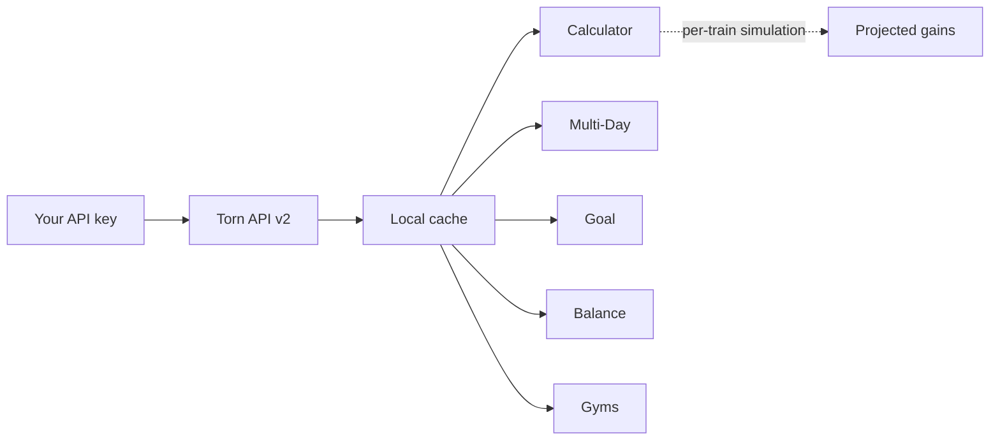

<div align="center">


<br><br>

# Torn Gym Gains Calculator+

**A userscript for [Torn City](https://www.torn.com) that pulls your account data from the API and gives you precise gym training projections, multi-day plans, goal estimations, ratio balancing, and full gym comparisons, all built on Vladar's gain formula.**

<br>

[Installation](#installation) · [Tabs](#tabs) · [Balance Tab](#balance-tab-in-depth) · [FAQ](#faq) · [Changelog](#changelog)

</div>

---

> [!NOTE]
> **TL;DR** Install, open the panel on `torn.com/gym.php`, paste a limited API key, hit Load. The script tells you exactly what each gym session will gain before you spend a point of energy.

## What it does

The game shows you nothing about how gains scale. This script fills that gap. It simulates your actual training session down to the individual train, accounts for every perk and bonus, and tells you exactly what you are going to gain before you spend a single point of energy.

Everything runs locally in your browser. No data leaves your machine except to the official Torn API using your own key.

### At a glance

| Tab | Answers the question |
|---|---|
| **Calculator** | How much will one session gain me right now? |
| **Multi-Day** | How much over a week or a month of training? |
| **Goal** | How long until I hit a target stat or a percentage increase? |
| **Balance** | What do I train, and in what order, to reach a stat ratio or qualify for a special gym? |
| **Gyms** | Which gym gives me the most per point of energy? |
| **Setup** | API key, themes, and cache info. |



---

## Installation

**Requirements:** Tampermonkey (Chrome/Firefox/Edge) or Violentmonkey.

1. Install [Tampermonkey](https://www.tampermonkey.net/) if you have not already.
2. Click the install link on the [Greasy Fork page](https://greasyfork.org/scripts/575551).
3. Confirm the install.
4. Navigate to `torn.com/gym.php`.
5. Click the **GYM CALC** button that appears in the bottom-left corner.
6. Go to the **Setup** tab, paste your Torn API key, and click **Load everything from API**.

That's it. Every field fills automatically from your account.

> [!TIP]
> A **limited** API key is all you need. The script only reads gyms, bars, battle stats, and perks, and it never writes anything.

> [!IMPORTANT]
> Data does not load automatically on install. Open the **Setup** tab and click **Load** once. After that it caches and reuses your data until you reload.

---

## Tabs

<details>
<summary><strong>Calculator</strong> - Single session projection</summary>

<br>

The baseline tab. Set your stat, happy, energy, and gym and get a full breakdown of what one session produces.

| Field | What it means |
|---|---|
| Stat total | Your current value for the selected stat |
| Happy | Starting happiness for the session |
| Energy | Total energy budget to spend |
| Gym | Which gym you are training at |

**Jump presets** let you model item-boosted sessions without manually entering the resulting happy and energy values. Choco Jump, Happy Jump, 99k Jump, and a fully custom option are all available.

**Bonuses & Perks** auto-fills from your API data but can be edited manually. Includes property, education (general + stat-specific), faction steadfast, faction candy boost, job, and book bonuses.

Results show total gain, final stat, happy consumed, energy used, and an estimated session cost in consumables.

</details>

<details>
<summary><strong>Multi-Day</strong> - Project gains over time</summary>

<br>

Takes your Calculator settings and simulates them forward across a schedule you define.

- **Total days** - how many calendar days to project
- **Train every X days** - if you do not train every day
- **Sessions per train day** - how many full sessions per training day

Outputs total gain, final stat, average per session, total energy, and a cost breakdown for the full period.

</details>

<details>
<summary><strong>Goal</strong> - Work backwards from a target</summary>

<br>

Three modes:

| Mode | What you enter | What you get |
|---|---|---|
| Stat target | The absolute stat value you want | Days, sessions, and energy needed |
| % increase | How much you want to grow relative to now | Same |
| Project days | A fixed number of days | Where you end up |

Long projections run fast. The simulation skips per-train history allocation and only computes what is needed.

</details>

<details>
<summary><strong>Balance</strong> - Train toward a stat distribution</summary>

<br>

See the [Balance Tab In Depth](#balance-tab-in-depth) section below.

</details>

<details>
<summary><strong>Gyms</strong> - Compare every gym at once</summary>

<br>

Runs your current Calculator stat, happy, energy, and bonus configuration against every gym that trains your selected stat. Sorted by per-session gain.

Columns: gym name, dots, energy cost per train, gain per single train, gain for a full session, and gain per energy unit.

Your currently selected gym is marked with a star.

</details>

<details>
<summary><strong>Setup</strong> - API key, theme, and cache info</summary>

<br>

Paste your API key here and hit **Load everything from API**. The script fetches your gyms, battle stats, max happy, max energy, active gym, and all perk strings in two API calls.

Also contains the theme picker (six color schemes), a cache summary showing when data was last loaded, a panel position reset button, and a full reset option.

</details>

---

## Balance Tab In Depth

This tab answers the question: *given how my stats are distributed right now, what do I need to train and in what order to reach a specific ratio?*

### Custom Ratio mode

Enter four percentages that sum to 100. The script looks at your current stat distribution, figures out which stats are under their target share, and builds a training plan that brings you there one train at a time.

Use the **Normalize** button if your numbers are close to 100 but not exact.

### Special Gyms mode

Pick one or two special gyms you want to qualify for. The script calculates the target stat distribution that satisfies both requirements simultaneously and builds the plan toward it.

Incompatible combinations are automatically greyed out in the picker. You cannot select two gyms whose requirements directly contradict each other.

**Valid dual-gym combinations and their target ratios:**

| Combo | STR | DEF | SPD | DEX |
|---|---|---|---|---|
| Balboas + Isoyamas | 22.2% | 31.0% | 22.2% | 24.6% |
| Balboas + Elites | 22.2% | 24.6% | 22.2% | 31.0% |
| Balboas + Gym 3000 | 35.0% | 28.0% | 9.0% | 28.0% |
| Balboas + Total Rebound | 9.0% | 28.0% | 35.0% | 28.0% |
| Frontline + Gym 3000 | 31.0% | 22.2% | 24.6% | 22.2% |
| Frontline + Total Rebound | 24.6% | 22.2% | 31.0% | 22.2% |
| Frontline + Isoyamas | 27.8% | 35.0% | 27.8% | 9.4% |
| Frontline + Elites | 27.8% | 9.4% | 27.8% | 35.0% |

### Automatic gym selection

The Balance tab picks the gym for you, separately for each stat, and it does not use the gym selected on the Calculator tab.

Which gyms it can choose from:

- **Your unlocked gyms**, read from the gym page itself. There is no API endpoint that reports gym membership, so the script reads the gym list on the page. Gyms you have not unlocked, and the one you are still earning gym EXP toward, are excluded. If the page cannot be read for any reason, it falls back to assuming every gym up to your active one is available.
- **Special gyms**, whenever your stats satisfy the requirement at that point in the plan.

Because energy per train is a straight multiplier on gains, the best gym for a stat is simply the one with the most dots on it. A 50 energy special gym is not more expensive per point than a 10 energy gym, so the planner always takes the highest dots available.

Special gym access is rechecked as the plan runs. Training the stats that are behind is exactly what breaks a special gym requirement, so the plan will show you dropping out of one partway through and moving to your best normal gym. That is real, not an error.

Each stat is also planned with **its own perks**. Faction Steadfast is often uneven, for example 12% on strength and defense but 10% on speed and dexterity, and education perks are frequently stat specific. The breakdown table shows the multiplier used for each stat.

### Precision toggle

- **Precise** - stops when all four stats are within 0.5% of target
- **Fast** - stops when all stats are within 1.0% of target (shorter plan, less accurate)

In gym mode, neither setting ever stops before the actual gym requirements are met, regardless of the ratio deviation.

### The plan output

The summary shows total trains needed, estimated days based on your daily energy budget, total energy cost, and how many different gyms the plan uses. Below that is a stat breakdown table listing the gyms and perk multiplier used per stat, then the day-by-day plan.

The plan is grouped into **phases**. Every day inside a phase is identical, so a phase is a single card with exact whole numbers:

```
Days 1 - 28    28 days · 76 trains/day · 1000E/day
  DEF   35/day · 350E/day · Cha Cha's
  DEX   35/day · 350E/day · Cha Cha's
  STR    6/day · 300E/day · Gym 3000
```

Open the card covering today, do exactly those trains, close it. A new phase starts only when something real changes: gaining or losing access to a special gym, or a remainder that does not divide evenly across the days. The first 40 phases are shown.

**How the energy model works:** the energy value in the Calculator tab is your total daily budget. Each gym has its own energy cost per train, so a day can mix a 50 energy special gym with a 10 energy normal gym. The planner divides each phase's trains evenly across its days, adds days if the fullest day would exceed your budget, and never schedules a day you cannot afford. Energy left over at the end of a day is energy too small to fit another train.

---

## The Formula

The script uses Vladar's gain formula as documented by the Torn community.

$$
\text{gain} = \frac{S_{\text{cap}} \cdot m_H + 8H^{1.05} + \text{adj} + B}{200000} \cdot \frac{D}{10} \cdot E \cdot \prod_i (1 + p_i)
$$

$$
m_H = 1 + 0.07 \ln\left(1 + \frac{H}{250}\right)
\qquad
\text{adj} = \left(1 - \left(\frac{\min(H,\,99999)}{99999}\right)^2\right) A
$$

Where:
- $S_{\text{cap}}$ - your stat. Below 50M it is unchanged. Above 50M a soft cap applies: $50000000 + 0.057406 \cdot (S - 50000000)^{0.928996}$
- $m_H$ - the happy multiplier, $1 + 0.07 \ln(1 + H/250)$
- $H$ - your current happiness
- $\text{adj}$ - a happy-dependent term that scales the per-stat constant $A$. It contributes the full $A$ at zero happy and fades to 0 as happy approaches 99999
- $A$, $B$ - per-stat constants (strength 1600/1700, defense 2100/-600, speed 1600/2000, dexterity 1800/1500)
- $D$ - gym dots (so $D/10$ is the gym multiplier)
- $E$ - energy per train
- $p_i$ - each active bonus as a fraction, multiplied together

Happy degrades each train by approximately $0.1 \cdot E \cdot 5$ points. Sessions are simulated train by train to capture this decay accurately.

---

## FAQ

<details>
<summary>The script is not appearing on gym.php</summary>

Make sure Tampermonkey is enabled and the script is active. Check the Tampermonkey dashboard and confirm the script shows as "Enabled". Some browser extensions or content security policies on other pages can interfere, but gym.php specifically should work without issues.

</details>

<details>
<summary>My stats or gym are not loading</summary>

Go to the Setup tab and click Load. The script does not load API data automatically on install, you have to trigger it manually. After that it caches the data and reuses it until you reload again.

</details>

<details>
<summary>The Balance tab is telling me I already meet the target</summary>

Your current stat distribution is already within the precision threshold of the target ratio. If you are in gym mode and it still says this but you cannot enter the gym in-game, the issue is that the game checks actual raw stat values, not just ratios. Training gaps might be smaller than one train, or another requirement (like having unlocked the prerequisite gym) has not been met.

</details>

<details>
<summary>Why does the Balance tab use the Calculator gym for everything?</summary>

Because the goal is to give you a concrete, actionable plan based on what you are actually training with, not a theoretical best-case using a different gym per stat. Set whichever gym makes sense in the Calculator and the Balance tab will plan around it.

</details>

<details>
<summary>Can I trust the gain estimates?</summary>

They are accurate to the formula. Real in-game gains have a random component per train (a stat-specific variance term). The script uses the deterministic average, so individual trains will vary slightly but session totals will be close. Over a long multi-day plan the variance averages out.

</details>

<details>
<summary>My bonuses look wrong</summary>

Check the Bonuses & Perks section in the Calculator tab. The script parses perk strings from the API using regex matching, which covers the standard formats Torn uses. If you have an unusual perk description format that the parser misses, you can override any field manually. Hit "Reset to detected" to restore API values at any time.

</details>

---

## Special Gym Requirements

For reference, the stat requirements for each special gym (prerequisite gym unlocks not listed, only the stat conditions):

| Gym | Energy | Requirement |
|---|---|---|
| Balboas Gym | 25E | DEF + DEX >= 125% of STR + SPD |
| Frontline Fitness | 25E | STR + SPD >= 125% of DEF + DEX |
| Gym 3000 | 50E | STR >= 125% of second highest stat |
| Mr. Isoyamas | 50E | DEF >= 125% of second highest stat |
| Total Rebound | 50E | SPD >= 125% of second highest stat |
| Elites | 50E | DEX >= 125% of second highest stat |

---

## Changelog

<details>
<summary><strong>v1.7.2</strong> - Gyms are back</summary>

<br>

- **Fixed:** Every gym dropdown was empty and said "No gyms train this stat", which left the whole script unusable and the Balance tab with nothing to plan. The gym list loads again, with the same dots and energy costs as always.
- **Fixed:** The Calculator stopped opening on the gym you actually train in. It picks yours again.
- **Changed:** If the gym list ever fails to load, the script now says so on Load instead of quietly showing you empty dropdowns.

</details>

<details>
<summary><strong>v1.7.1</strong> - Mobile and PDA layout</summary>

<br>

- **Fixed:** Balance plan cards were cramped on a phone. The day card header and the train rows were fixed single-line flex layouts sized for a desktop panel, so the longer v1.7.0 text squeezed the gain figure. Train rows are now a three column grid, the header wraps, and gym names stay whole instead of breaking mid-name.
- **Changed:** The Gym column in the breakdown table no longer repeats the train count when a stat uses only one gym, since the count already has its own column.
- **Changed:** Shortened the explanatory line at the top of the Balance tab, which ran to six lines on a phone.

</details>

<details>
<summary><strong>v1.7.0</strong> - Balance tab gym selection</summary>

<br>

- **Added:** The Balance plan picks a gym for each stat. It used to run the whole plan through the single gym selected on the Calculator tab, spending trains there even on stats that gym barely trains. Each stat now gets the best gym available to it, and the Calculator gym is no longer used by this tab. Energy per train is a straight multiplier on gains, so a 50 energy special gym costs no more per stat point than a 10 energy gym and the highest dots always wins.
- **Added:** Unlocked gym detection. Torn's API does not expose gym membership, only `active_gym`, at any key access level. The script now reads your gym list from the gym page directly, which costs no API call and needs no key upgrade. Gyms you have not unlocked are excluded, as is the gym you are currently earning gym EXP toward. If the page cannot be read, it falls back to assuming everything up to your active gym is available.
- **Added:** Special gym access is tracked as the plan runs. Special gyms enter the plan whenever your stats meet the requirement at that point and drop out when they no longer do. Training your lagging stats is what breaks a special gym requirement, so a plan that starts in Gym 3000 will show you leaving it partway through.
- **Added:** Two columns in the Balance breakdown table, showing which gyms each stat uses and the perk multiplier applied to it.
- **Fixed:** Every stat in the Balance plan was calculated with one stat's perks. The tab read the bonuses computed for whichever stat was selected on the Calculator tab and applied them to all four. If your faction Steadfast is uneven, for example 12% on strength and defense but 10% on speed and dexterity, or your education perks are stat specific, every other stat in the plan was wrong. Each stat now uses its own perks. Manual edits to the Calculator bonus fields are not used by the Balance tab, since one set of fields cannot describe four stats.
- **Changed:** The day-by-day plan is grouped into phases. It previously rendered one card per day for the first 90 days, each listing consecutive train runs. Days are now built so that every day inside a phase is identical, making a phase a single card with exact whole train counts. A new phase begins only when special gym access changes or a remainder does not divide evenly across the days.

</details>

<details>
<summary><strong>v1.6.1</strong> - Perk reading fix</summary>

<br>

- **Fixed:** Gym gain perks were silently ignored. The v2 migration changed where perks live in the API response: v1 returned them as flat top-level fields (`faction_perks`, `education_perks`, and so on), v2 nests them under a single `perks` object keyed by source (`faction`, `job`, `property`, `education`, `book`). The script was still reading the old flat field names, so every perk list came back empty and all gym gain bonuses parsed as zero. If you have faction Steadfast, the property gym gain bonus, or education gym gain bonuses, your estimates were low.
- **Fixed:** Added `cdn.jsdelivr.net` to `@connect`. The last-resort Chart.js fetch fallback was blocked by the connect allowlist. It only fires if both `@require` and the script tag fail, which is close to impossible on desktop, but the allowlist is now correct.
- **Changed:** Dropped the remaining v1 compatibility code. Both API calls have been v2 only since v1.5.0, so the leftover v1 field handling in the battle stat reader was dead code.

</details>

<details>
<summary><strong>v1.5.0</strong> - API v2 migration and UI polish</summary>

<br>

- **Changed:** Migrated to the Torn API v2 endpoints. The script now reads from `/v2/torn/gyms` and `/v2/user` instead of the older v1 selections endpoints. Every value was verified identical to v1 before the switch: gym list, battle stats, max happy, max energy, active gym, and all perk strings match byte for byte. Nothing about your gains, bonuses, or perks changed, this is purely the data source moving to the current API version.
- **Improved:** Accessibility and cross-browser compatibility.
  - Keyboard focus is now always visible on inputs, even on browsers that do not support modern CSS color functions.
  - Added solid color fallbacks so the active tab, the best-gym highlight in the Gyms table, and hover states stay visible on older browsers instead of disappearing.
  - The panel can now be dragged with touch and pen, not just a mouse.
- **Improved:** Readability.
  - Larger, clearer tab labels.
  - Lifted the muted text color across all six themes for better contrast on hints and sub-labels.
  - Four-column input rows collapse to two columns on very narrow screens.

</details>

<details>
<summary><strong>v1.4.0</strong> - Balance tab</summary>

<br>

- **Added:** Balance tab, between Goal and Gyms. A tab dedicated to planning training toward a target stat distribution, either a custom ratio you define or the stat requirements of one or two special gyms.
  - Custom ratio mode: enter four percentages summing to 100, get a day-by-day training plan.
  - Special gym mode: pick one or two gyms, the script derives the correct target ratio from their requirements and plans toward it.
  - Incompatible gym pairs are blocked in the picker, based purely on whether their stat requirements can be simultaneously satisfied.
  - All eight valid dual-gym combinations are supported with algebraically derived target ratios.
  - Fast and Precise toggle: 1.0% or 0.5% convergence threshold.
  - In gym mode, the plan never stops before the actual gym stat requirements are met, regardless of precision setting.
  - Day-by-day plan cards showing trains per stat, energy cost, and estimated gain per block.
  - Daily energy budget model: the Calculator energy field is your total daily budget, the Calculator gym cost per train determines how many trains fit per day.
  - The last day of the plan uses only the remaining trains needed, never a forced full day.
  - Three ratio bars (current, after plan, target) for visual comparison.
  - Training breakdown table with final values, final percentages, and deviation from target per stat.
- **Fixed:** Balance tab gym pair compatibility. The correct set of incompatible pairs is now enforced. Pairs are blocked if and only if their stat requirements mathematically cannot be simultaneously satisfied, which turns out to be Balboas against Frontline, and any two solo gyms.
- **Changed:** The status bar on load shows total battle stats instead of the selected single stat.

</details>

<details>
<summary><strong>v1.3.1</strong> - GitHub link</summary>

<br>

- **Added:** GitHub button in the Setup tab linking to this page.

</details>

<details>
<summary><strong>v1.3.0</strong> - Color themes</summary>

<br>

- **Added:** Color themes. A theme picker in the Setup tab switches the whole panel between six schemes: Matrix, Deep Ocean, Ember, Amethyst, Goldrush, and Slate. Each theme shows a live swatch preview before you commit.

</details>

<details>
<summary><strong>v1.2.2</strong> - Speed and stability</summary>

<br>

- **Fixed:** Long projections in Goal and Multi-Day no longer freeze the panel.
- **Fixed:** Stale calculations from a previous tab no longer overwrite the current view. If you switch tabs mid-projection, the old result is discarded.
- **Fixed:** The Setup tab no longer overflows on narrow widths. Long perk strings wrap cleanly.
- **Fixed:** The panel body could be squeezed to zero height on very short viewports. Layout is now properly flex-constrained.
- **Fixed:** Body scroll position no longer carries over between tabs. Each tab opens at the top.
- **Fixed:** The drag handle correctly ignores clicks on inputs, selects, and labels, not just buttons.
- **Improved:** Multi-Day, Goal, and Gyms are significantly faster. The simulation skips per-train history arrays when only totals are needed.
- **Improved:** Settings persist on a 200ms debounce instead of writing on every keystroke.
- **Improved:** Active stat pills have a colored glow matching the stat, with a press animation on click.
- **Improved:** Buttons and icon buttons get a subtle hover background.
- **Improved:** Result grids collapse to a single column at 600px and below.
- **Improved:** Warning messages use a consistent style across every tab.
- **Improved:** Chart re-render animation shortened from 1000ms to 250ms.
- **Improved:** Scrollbar thumb gets a brighter highlight on hover.

</details>

<details>
<summary><strong>v1.2.1</strong> - Cost model and bonus fixes</summary>

<br>

- **Added:** Gain per energy readouts in the Gyms and Calculator tabs.
- **Added:** Star marker next to your current gym in the Gyms tab.
- **Added:** Warning if happiness drops to 0 during a session.
- **Added:** Reset bonuses to API-detected values button.
- **Added:** Per-day and total cost breakdowns in Multi-Day and Goal, for example "3 xanax + 1 refill + 600E natural" per day, scaled across the full schedule.
- **Added:** Jump preset cost display. Picking Choco, Happy, or Custom shows the actual items needed rather than an energy estimate.
- **Added:** Warning if daily energy exceeds the regen plus 1 refill plus 3 xanax cap, with the shortfall shown.
- **Fixed:** Stat bonuses from properties, jobs, and books apply only to their specific stats.
- **Fixed:** The tool no longer freezes when starting a session with 0 energy.
- **Fixed:** Auto gym pick correctly skips zero-dot gyms.
- **Fixed:** Chart tooltips format large numbers correctly and consistently.
- **Changed:** Xanax estimates in Multi-Day and Goal are now realistic. They account for natural energy regen and the daily refill first, so xanax only appears when actually needed.
- **Changed:** Calculator session cost uses the same regen, refill and xanax model.
- **Improved:** Cleaner layouts across multiple tabs and better bonus breakdowns in the Setup tab.

</details>

<details>
<summary><strong>v1.0.2</strong> - 50M gain cap</summary>

<br>

- **Changed:** Removed the 50M cap on gym gains. Calculations work correctly beyond that threshold.

</details>

<details>
<summary><strong>v1.0.1</strong> - Panel position fixes</summary>

<br>

- **Added:** Reset position button, the corner arrow icon in the panel header.
- **Added:** Reset panel position button in the Setup tab.
- **Fixed:** The panel could load with its header above the viewport if the saved position no longer fit the current window size or zoom level, making it impossible to minimize. Position is now clamped on load, on window resize, and after dragging.
- **Changed:** Reset Everything also resets panel position.

</details>

---

<div align="center">

Made for Torn by **Rowage [3926289]** &nbsp;|&nbsp; GPL-3.0 &nbsp;|&nbsp; [Install on Greasy Fork](https://greasyfork.org/scripts/575551)

</div>
